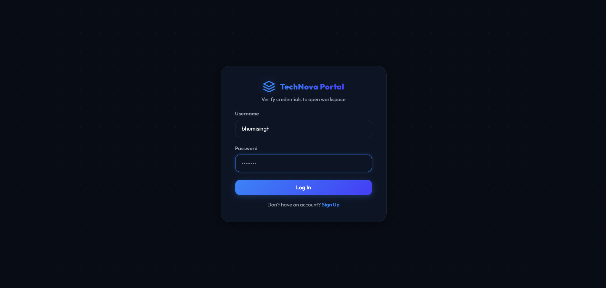
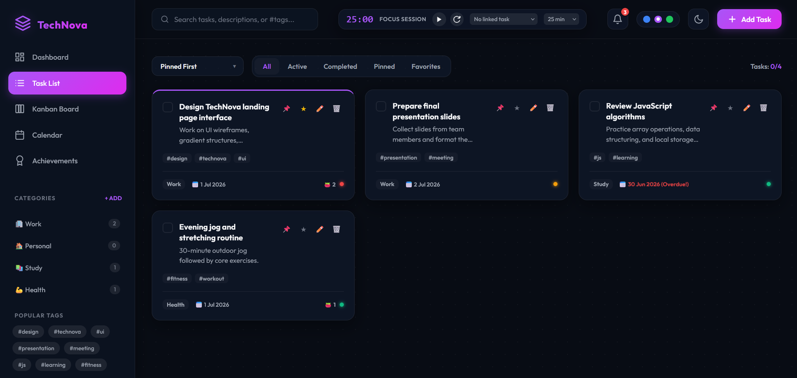
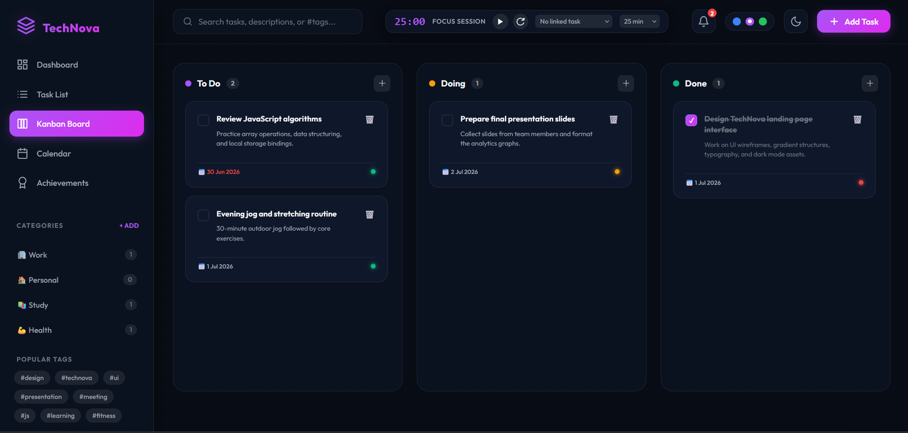
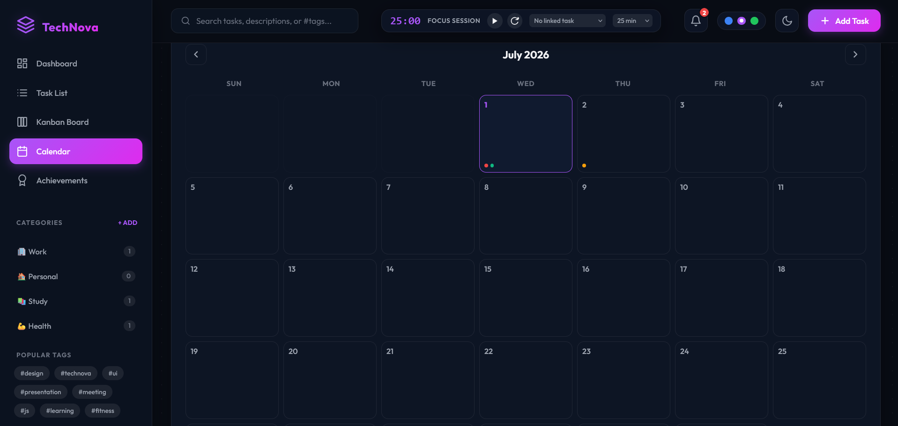
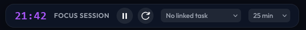
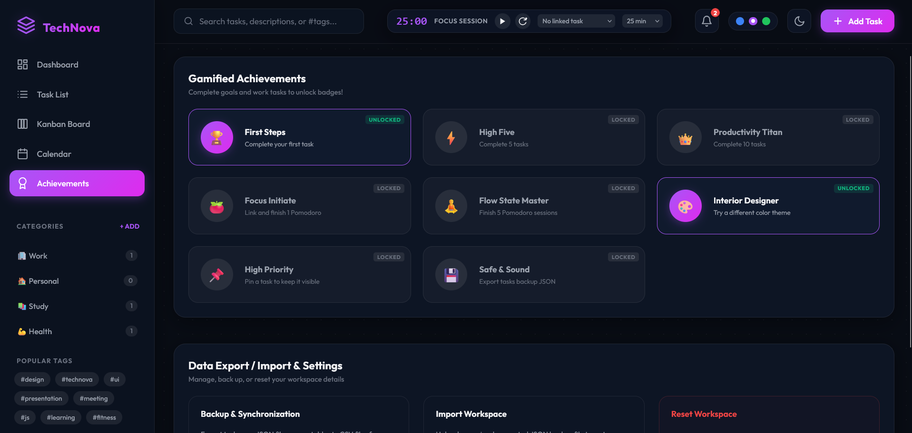
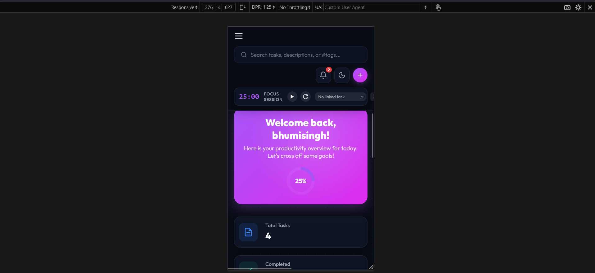

# 🚀 TechNova Task Manager & Productivity Dashboard

<div align="center">


# **TechNova Task Manager**

### 🌟 A Premium Productivity Workspace for Modern Task Management

**TechNova** is a feature-rich productivity dashboard inspired by modern project management tools. Built using **HTML5, CSS3, Vanilla JavaScript, Node.js, and MySQL**, it combines task management, Kanban workflows, Pomodoro focus sessions, analytics, gamification, calendars, and persistent storage into a beautiful glassmorphic interface.

<p align="center">


</p>

---

## 🌐 Live Demo

> 🔗 **Coming Soon**

---

# 🎥 Project Preview

<p align="center">


</p>

*A quick walkthrough of the complete application.*

---

# 📸 Application Screenshots

## 🏠 Dashboard


View productivity statistics, progress rings, task summaries, quick actions, and personalized greetings.

Monitor:

* Weekly Performance
* Completion Rate
* Productivity Charts
* Focus Statistics

Powered by **Chart.js**.

---

## 🔐 Login & Registration



Secure authentication system with account creation, validation, and persistent sessions.

---

## ✅ Task Management



Features include:

* Priority Levels
* Categories
* Tags
* Due Dates
* Favorites
* Pin Tasks
* Edit & Delete
* Completion Status

---

## 📋 Kanban Workflow



Interactive drag-and-drop task organization across:

* 📌 To Do
* 🚧 Doing
* ✅ Done

---

## 📅 Calendar Planner



Monthly planner with due-date indicators and quick navigation.

---

## ⏱ Pomodoro Focus Mode



Boost productivity with customizable focus sessions, break reminders, and audio notifications.

---

## 🏆 Achievement System



Unlock badges including:

* First Task
* Daily Streak
* Productivity Titan
* Backup Hero
* Flow State Master

---

## 🔍 Smart Search & Filters


Search tasks instantly and filter using:

* Priority
* Category
* Status
* Favorites
* Due Date
* Tags

---

## 🎨 Theme Customizer


Personalize your workspace with:

* 🌙 Dark Mode
* ☀️ Light Mode
* Multiple Accent Colors
* Responsive Layout

---

## 📱 Mobile Experience



Fully responsive interface optimized for tablets and smartphones.

---

# ✨ Key Features

## 👤 Authentication

* Secure Login & Registration
* Session Management
* Personalized Dashboard
* Persistent User Accounts

---

## ✅ Task Management

* Create Unlimited Tasks
* Categories
* Custom Tags
* Priority Levels
* Due Dates
* Favorites
* Pin Tasks
* Edit/Delete
* Completion Tracking

---

## 📋 Kanban Board

* Drag & Drop
* Live Counters
* Quick Add
* Mobile Tab View
* Real-Time Updates

---

## 📊 Analytics Dashboard

* Animated Statistics
* Completion Progress Ring
* Weekly Reports
* Productivity Summary
* Interactive Charts

---

## 📅 Calendar Planner

* Monthly Calendar
* Due Date Highlights
* Daily Tasks Drawer
* Navigation Controls

---

## ⏱ Pomodoro Timer

* 15 / 25 / 30 / 45 / 60 Minute Sessions
* Audio Alerts
* Break Notifications
* Focus Statistics
* Linked Tasks

---

## 🏆 Gamification

* Achievement Badges
* Daily Streaks
* Productivity Levels
* Progress Tracking

---

## 💾 Data Management

* LocalStorage Backup
* JSON Export
* JSON Import
* CSV Export
* Workspace Reset

---

## 🎨 Modern UI

* Glassmorphism Design
* Responsive Layout
* Dark & Light Themes
* Accent Color Switcher
* Smooth Animations

---

# 🛠 Technology Stack

| Category | Technologies                               |
| -------- | ------------------------------------------ |
| Frontend | HTML5, CSS3, JavaScript (ES6)              |
| Backend  | Node.js                                    |
| Database | MySQL                                      |
| Charts   | Chart.js                                   |
| APIs     | Drag & Drop API, Canvas API, Web Audio API |
| Storage  | LocalStorage                               |

---

# 🏗 Project Architecture

```text
               User
                 │
                 ▼
        Frontend (HTML/CSS/JS)
                 │
        AJAX Fetch Requests
                 │
                 ▼
          Node.js Server
                 │
                 ▼
             MySQL Database
                 │
                 ▼
        Persistent User Data
```

---

# 📂 Project Structure

```text
TechNova_TaskManager/
│
├── index.html
├── styles.css
├── app.js
├── server.js
├── db.js
│
├── screenshots/
│   ├── dashboard.png
│   ├── login.png
│   ├── tasks.png
│   ├── kanban.png
│   ├── calendar.png
│   ├── analytics.png
│   ├── pomodoro.png
│   ├── achievements.png
│   ├── search.png
│   ├── theme.png
│   ├── mobile.png
│   └── demo.gif
│
└── README.md
```

---

# 🚀 Getting Started

## Prerequisites

* Node.js
* MySQL Server
* npm

---

## Installation

```bash
git clone https://github.com/yourusername/TechNova_TaskManager.git

cd TechNova_TaskManager

npm install

node server.js
```

Open:

```
http://localhost:3001
```

---

# 🚀 Future Enhancements

* AI Task Prioritization
* Google Authentication
* Microsoft Login
* Team Collaboration
* Shared Workspaces
* Email Notifications
* Push Notifications
* Cloud Synchronization
* Progressive Web App (PWA)
* Voice Assistant
* Offline Mode
* AI Productivity Insights

---

# 👩‍💻 About the Developer

## **Bhumi Singh**

**B.Tech – Computer Science Engineering (Artificial Intelligence)**

💻 Java Full Stack Developer

🌐 Frontend Developer

☕ Java Enthusiast

🚀 Aspiring Software Engineer

---

# ⭐ Support

If you enjoyed this project or found it useful, please consider giving it a **⭐ Star** on GitHub.

It motivates future development and helps others discover the project.

---

<div align="center">

### 💙 Made with Passion by Bhumi Singh

</div>

