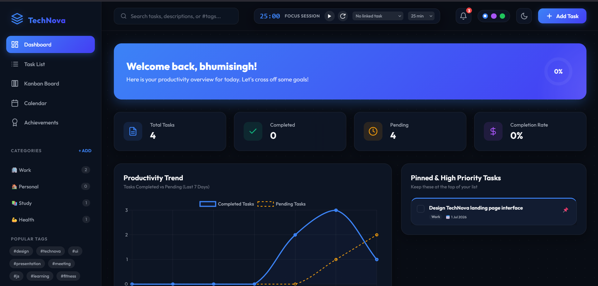

# 🚀 TechNova Task Manager & Productivity Dashboard

<div align="center">

### A Modern Productivity & Task Management Platform

An advanced productivity dashboard built with **HTML5, CSS3, and Vanilla JavaScript**, featuring Kanban workflows, Pomodoro focus sessions, productivity analytics, gamification, and persistent local storage.

<p>


</p>

</div>

---

# 📖 Overview

TechNova Task Manager is a feature-rich productivity application designed to help users organize their daily workflow efficiently.

Unlike a basic To-Do application, it combines task management, Kanban boards, Pomodoro focus sessions, analytics dashboards, achievements, data export/import, and customizable themes into a single responsive workspace.

All application data is stored locally using the browser's LocalStorage API, allowing users to continue working even after refreshing the page.

---

# ✨ Features

## 👤 User Workspace

* User Registration & Login
* Personalized Dashboard
* Session Management
* Secure Local Storage
* Welcome Messages

---

## ✅ Task Management

Create and manage tasks with:

* Title
* Description
* Priority Levels
* Categories
* Due Dates
* Custom Tags
* Pin Tasks
* Favorite Tasks
* Edit Tasks
* Delete Tasks
* Mark Complete

---

## 📊 Productivity Dashboard

Monitor productivity using:

* Animated Statistics Cards
* Completion Progress Ring
* Task Completion Percentage
* Weekly Analytics Charts
* Focus Drawer
* Productivity Summary

---

## 📋 Kanban Board

Interactive drag-and-drop workflow.

Columns include:

* To Do
* Doing
* Done

Features:

* Drag & Drop
* Live Counters
* Quick Add
* Instant Updates

---

## 📅 Calendar Planner

* Monthly Calendar View
* Due Date Indicators
* Daily Task Drawer
* Previous / Next Month Navigation

---

## ⏱ Pomodoro Focus Timer

* 25-Minute Focus Sessions
* Break Notifications
* Task Linking
* Focus Statistics
* Audio Alerts

---

## 🏆 Achievement System

Unlock badges such as:

* First Task Completed
* Productivity Titan
* Flow State Master
* Daily Streak
* Backup Hero

---

## 🔍 Search & Filters

Powerful filtering options:

* Search Tasks
* Category Filter
* Status Filter
* Favorites
* Pinned Tasks
* Priority Filter

Sorting options:

* Due Date
* Priority
* Name
* Completion Status

---

## 💾 Data Management

* LocalStorage Persistence
* JSON Export
* JSON Import
* CSV Export
* Workspace Reset

---

## 🎨 UI Features

* Glassmorphism Design
* Dark / Light Mode
* Accent Color Themes
* Responsive Layout
* Smooth Animations
* Mobile Friendly

---

# 🛠 Technology Stack

## Frontend

* HTML5
* CSS3
* JavaScript (ES6)

## Browser APIs

* LocalStorage API
* Drag & Drop API
* Web Audio API
* Canvas API

## Libraries

* Chart.js

---

# 📂 Project Structure

```text
TechNova_TaskManager/
│
├── index.html
├── styles.css
├── app.js
├── README.md
└── assets/
```

---

# 🚀 Getting Started

Clone the repository

```bash
git clone https://github.com/your-username/TechNova_TaskManager.git
```

Navigate into the project

```bash
cd TechNova_TaskManager
```

Open the project

```bash
Open index.html
```

Or run a local server

```bash
python -m http.server 5500
```

Visit

```text
http://localhost:5500
```

---

# 📊 Application Workflow

```text
Login
   │
   ▼
Dashboard
   │
Create Tasks
   │
Organize with Categories
   │
Track Progress
   │
Focus with Pomodoro
   │
Analyze Productivity
   │
Export Workspace
```

---

# 📸 Screenshots

Create a folder named:

```text
screenshots/
```

Add the following screenshots.

---

## 🏠 Dashboard

File:

```text
screenshots/dashboard.png
```

Capture:

* Statistics Cards
* Progress Ring
* Welcome Section

```md

```

---

## 🔐 Login Page

```text
screenshots/login.png
```

Capture:

* Login Form
* Sign Up Option

---

## ✅ Task Management

```text
screenshots/task-management.png
```

Show:

* Task Cards
* Priorities
* Categories
* Due Dates

---

## 📋 Kanban Board

```text
screenshots/kanban-board.png
```

Show:

* To Do
* Doing
* Done
* Drag & Drop

---

## 📅 Calendar

```text
screenshots/calendar.png
```

---

## 📊 Analytics Dashboard

```text
screenshots/analytics.png
```

Capture:

* Chart.js Graphs
* Completion Statistics

---

## ⏱ Pomodoro Timer

```text
screenshots/pomodoro.png
```

---

## 🏆 Achievements

```text
screenshots/achievements.png
```

---

## 🔍 Search & Filters

```text
screenshots/search-filter.png
```

---

## 🎨 Theme Customizer

```text
screenshots/themes.png
```

Show:

* Dark Mode
* Accent Colors

---

## 📱 Mobile Responsive View

```text
screenshots/mobile.png
```

Capture using Chrome DevTools mobile mode.

---

# 🚀 Future Enhancements

* Cloud Synchronization
* Google Authentication
* Team Workspaces
* Shared Projects
* Email Notifications
* AI Task Prioritization
* Voice Commands
* Progressive Web App (PWA)

---

# 👩‍💻 Author

## Bhumi Singh

**B.Tech CSE (Artificial Intelligence)**

Aspiring Software Engineer | Java Full Stack Developer | Frontend Developer

---

⭐ If you found this project useful, consider giving it a **Star** on GitHub!
